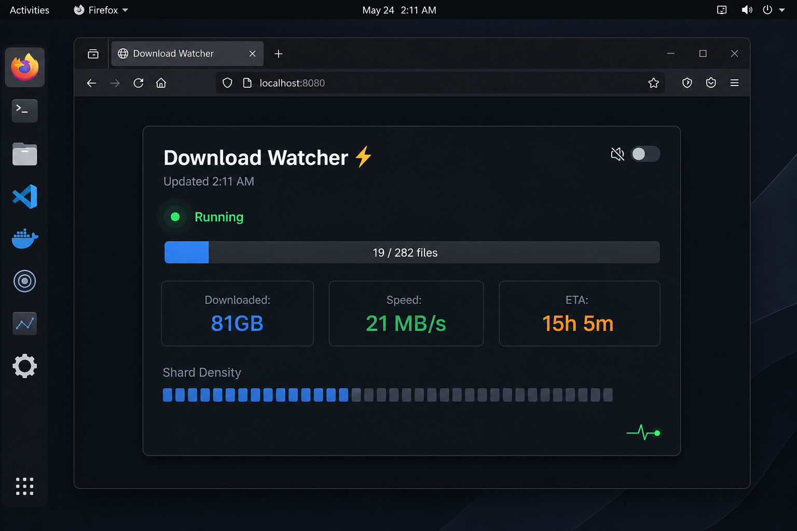

# ⚡ Download Watcher

A local dashboard for long-running downloads, model pulls, backups, and file transfers. Progress bar, speed, ETA, file notifications, stall detection, and audio alarms — all from a browser tab, no cloud, no account, no bullshit.



---

## Why this exists

Every time I pull a 300GB model, grab a Linux ISO, or run an overnight backup, I end up doing the same dance:

- Stare at a terminal scrolling nonsense
- Switch away, forget about it, come back to "curl: (56) Recv failure"
- Wonder if it's stuck or just slow
- Do the mental math on ETA
- Go to bed anxious, wake up to "No space left on device" at 2%

That's stupid. So I built a thing that sits in a browser tab, shows you real progress, and screams at you if it dies.

## What it does

| What | How |
|---|---|
| **Progress bar** | Animated fill with file count overlay |
| **Speed** | MB/s calculated from byte deltas |
| **ETA** | Live estimate based on current rate |
| **File notifications** | Pops up when each file/shard lands |
| **Milestones** | Alerts at every 10% |
| **Stall detection** | Flags if nothing changes for 5+ minutes |
| **Failure alarm** | 🔥 Loud 880Hz siren × 5 through your speakers (paplay) |
| **Browser siren** | Backup Web Audio alarm in the tab |
| **Muteable heartbeat** | Soft chirp every ~30s so you know it's alive — click mute for sleep |
| **Density map** | Visual grid of all files so you can see the pattern |

## How it looks

One browser tab. Dark theme. Updates every 2 seconds. Red panic mode on failure. You'll know.

```
  [████████░░░░░░░░░░░░░░░░░░░░░] 19 / 282 files

  Downloaded     Speed        ETA
     81 GB      21 MB/s     15h 5m

  ███████████████░░░░░░░░░░░░░░░░░░░░░░░░░░░░░░
```

## Works with anything

- Hugging Face model pulls (`hf download ...`)
- `rsync` over SSH
- `wget` / `curl` large files
- `git lfs pull`
- Docker image pulls (with systemd wrapper)
- Any process you wrap in a systemd user service
- Any directory where files land one by one

## Quick start

```bash
# One-time setup
bash watcher/dl-setup.sh
# → tells you: download directory, how many files, systemd service name

# Launch (or click the app icon)
bash watcher/dl-launcher.sh
# → opens http://localhost:18999
```

To pin to your taskbar: search "Download Watcher" in your app menu → right-click → Add to Favorites.

## Requirements

- Linux with PulseAudio (for audio alarms — `paplay`)
- Python 3 (for the server — ships with every distro)
- `jq` (for the monitor script — `apt install jq` or equivalent)
- `systemctl --user` if you want service monitoring
- A browser for the dashboard

That's it. No npm. No Docker. No API keys. No cloud.

For your next download, just run `dl-setup.sh` again with the new target and click the icon.

---

Made by someone who got tired of guessing whether their 300GB download was still alive.